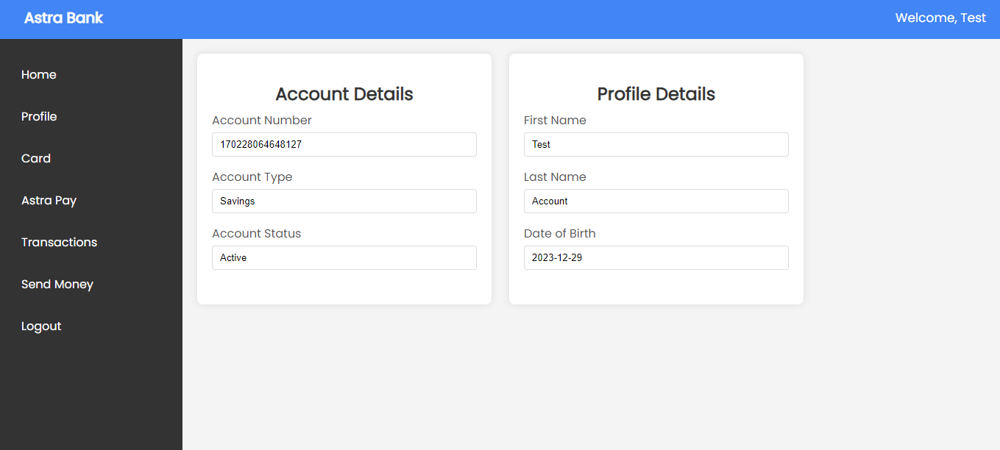
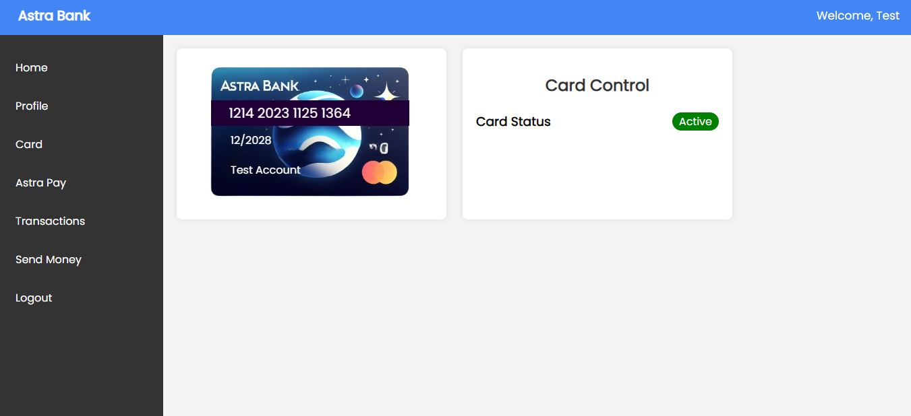

# Astra Bank

Welcome to Astra Bank Github Repository, a secure and user-friendly platform for managing your banking needs. This project is built with a robust tech stack to ensure reliability, security, and a seamless user experience.

[Visit Astra Bank Website](https://astrabank.netlify.app/)

## Features

## 1. Profile
All your details are available on the profile page including the account number and account status

## 2. Card Management
Easily manage your debit cards, view transactions, and control your card from the dashboard

## 3. Send Money
Initiate secure money transfers to friends, family, or businesses with just a few clicks.

## 4. Transactions
You can track and view your transaction history to stay informed about your financial activities.

## Astra Pay
Test your card with AstraPay for secure and seamless transactions. You can visit Astrapay from the dashboard

## Tech Stack

## Backend

- **Java:** A powerful, object-oriented programming language.
- **Spring Boot:** A framework for building Java-based, production-grade applications.
- **Spring Security:** Ensures the security of your application with customizable authentication and authorization.
- **Hibernate** An ORM (Object-Relational Mapping) framework for efficient database communication.
- **JWT (JSON Web Tokens):** Provides secure authentication and authorization mechanisms.

## Database

- **MySQL:** A relational database management system for storing and retrieving data.

## Frontend

- **HTML:** The standard markup language for creating web pages.
- **CSS:** A stylesheet language for enhancing the visual presentation of web pages.
- **JavaScript:** A versatile scripting language for adding interactivity to web pages.
